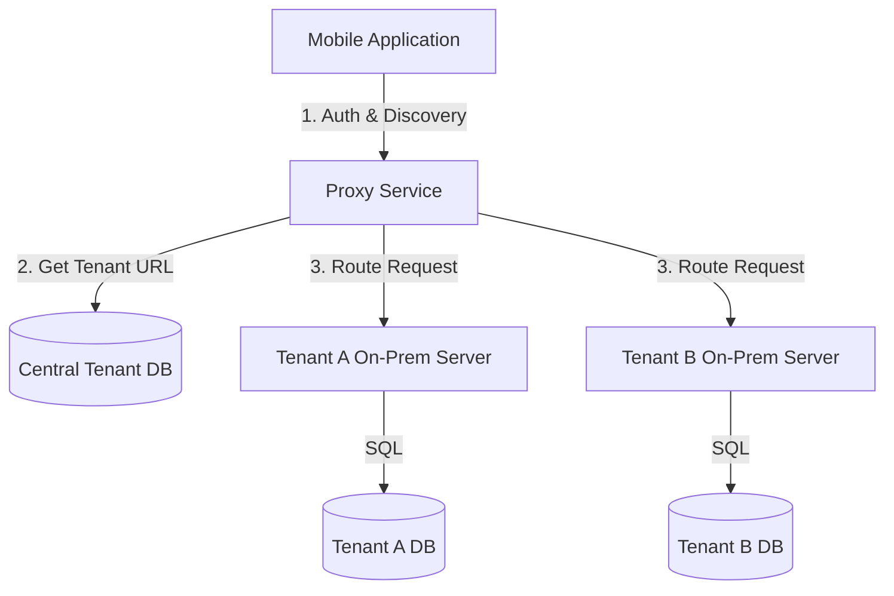

# ARCHITECTURE.md

## System Overview

This showcase demonstrates a comprehensive Multi-Tenant Enterprise HR Solution designed to bridge the gap between a centralized mobile interface and decentralized on-premises deployments for multiple tenants.

The architecture comprises three main pillars:
1.  **Proxy Service (Next.js)**: A high-availability dynamic router and security enforcer.
2.  **HR Solution Backend (.NET)**: A Clean Architecture-based monolith for HR operations.
3.  **HR Solution Frontend (Next.js)**: A feature-rich employee portal.

### Multi-Tenant On-Premises Architecture

The system solves the challenge of having a single mobile application that needs to connect to various on-premises tenant servers. Each tenant hosts their own instance of the HR Solution (.NET + SQL Server), ensuring data sovereignty and meeting strict enterprise security requirements.

## Key Design Decisions

1.  **Dynamic Routing & Multi-Tenancy**: The Proxy Service acts as the single point of entry for the mobile app, dynamically resolving tenant server URLs based on login credentials and company identifiers.
2.  **Clean Architecture (Backend)**: The .NET HR backend follows Clean Architecture principles to ensure separation of concerns, testability, and independence from external frameworks.
3.  **Next.js for Proxy and Frontend**: Chosen for its robust server-side capabilities, performance optimizations, and developer experience.
4.  **Security Enforcement (Proxy)**: The Proxy Service performs real-time checks for mobile app versioning, OS versioning, and device security (e.g., root detection) before allowing traffic to hit the tenant servers.
5.  **SQL Server**: Used as the primary relational database for both the central tenant management and individual tenant HR data.

## Deployment Strategy

*   **Hybrid Cloud/On-Prem**: The Proxy Service is typically hosted in a central cloud environment (e.g., Azure/AWS) to ensure global accessibility for the mobile app, while the HR Solution instances are deployed within each tenant's private infrastructure (on-premises).

## Security & Compliance

*   **JWT Authentication**: Secure stateless authentication across all services.
*   **Root Detection & Device Analysis**: Proactive security measures in the Proxy layer to prevent unauthorized or compromised access.
*   **Data Isolation**: Physical data isolation by deploying separate databases for each tenant.

---
